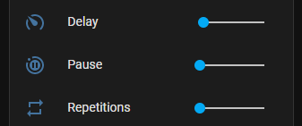

# Mipow Playbulb integration
This component has been created to be used with Home Assistant 2022.9 and above.

It allows to integrate with MiPow Playbulbs - bluetooth, battery controlled LED candles.

## Verified devices:
 - BTL300
 - BTL305ES
 - As the MiPow protocol is used across other MiPow LED devices, the integration should also support those devices 

## Version 3.0
This version is not backward compatible.
We recommend to remove the entites and configuration that was configured for lower versions.

## Supported features
This integration requires [Home Assistant Bluetooth](https://www.home-assistant.io/integrations/bluetooth/) integration.
The devices are discovered automatically or you can use MiPow integration from the integration list.
### Color light
In color mode you can control both white value and color separately.
When color is selected, the brigthness of the color is only changed, in this case the white value is controlled separately.
When no color is selected, then brightness represents white value.

   

### White light only
In this mode only white value is changed - any colors are removed.

   

### Battery sensor
For battery powered devices a battery sensor is available

   

## Effect configuration
The buiild-in effects can be controlled:
- delay - the lowest the value, the slowest the effect is
- repetitions - how many times the effect should be repeated
- pause - after repetitions, the light is turned off and the effect repeats

   

Mipow candles come with a predefined list of effects that are represented in HA by:
- light - no effects applied at all
- flash
- pulse
- rainbow
- colorloop
- candle

## Installation
This integration is not (yet) part of the official Home Assistant integrations.
You have to install it manually or install it via HACS. 
### HACS
 - Ensure HACS is installed
 - Add Custom Repository https://github.com/D3M80L/hassio-mipow
 - Install the integration
 - Restart Home Assistant

### Manual installation
 - Download the latest release
 - Unpack the release and copy *mipow* folder from the *custom_components* folder in this repository, to the folder *custom_components* in your Home Assistant installation
 - Restart Home Assistant
