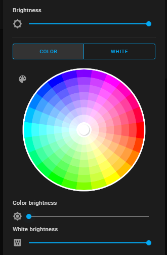
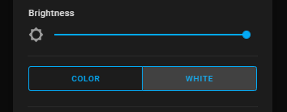
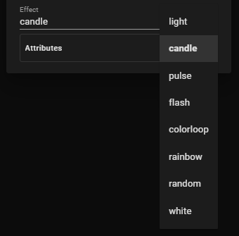
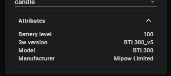

# Mipow Playbulb integration
This component has been created to be used with Home Assistant.

It allows to integrate with MiPow Playbulbs - bluetooth, battery controlled LED candles.

## Verified devices:
 - BTL300
 - BTL305ES

## Changelog
### 1.0.0
- better support of light control - supporting separate white and color modes
- updated effects - all in lowercase
- introduced random and white effect
- battery level scan is performed on every 10th update when the candle is turned off
- status update is locked when three failed connections occurs in a row
- persisting colors and states between HA restarts
- fetching device attributes like model, software version or manufacturer

## Installation

### HACS
 - Ensure HACS is installed
 - Add Custom Repository https://github.com/D3M80L/hassio-mipow
 - Install the integration
 - Configure your candles in configuration.yaml
 - Restart Home Assistant

### Manual installation
 - Download the latest release
 - Unpack the release and copy *mipow* folder from the *custom_components* folder in this repository, to the folder *custom_components* in your Home Assistant installation
 - Configure your candles in configuration.yaml
 - Restart Home Assistant

## Configuration
This integration requires manual configuration.
Playbulb candles are not automatically added to Home Assistant.
You need to know the MAC address of your device and use it in the configuration.

```yaml
light:
  - platform: mipow
    scan_interval: 90
    devices:
      "AA:BB:CC:DD:EE:FF":
        name: Name Your Device
      "FE:ED:AF:AC:E0:00":
        name: Name Your Second Device
```
### scan_interval
By default is set to 30 seconds in homeassistant, set it to higher value if you control the candle only from HA.

## Supported features
After restart, when the integration successfully connects to your device, you can control your candle directly from Lovelace card or by sending a service command:

```yaml
entity_id: light.name_your_device
rgb_color:
  - 255
  - 255
  - 0
brightness: 0..255
effect: light | flash | pulse | rainbow | colorloop | candle | random | white
white_value: 0..255
flash: short | long
transition: 0..255
```

### Color mode
In color mode you can control both white value and color separately.
When color is selected, the brigthness of the color is only changed, in this case the white value is controlled separately.
When no color is selected, then brightness represents white value.


### White mode
In this mode only white value is changed - any colors are removed.


### Effects
The device supports effects built into the device and available only in HA.


#### Build in candle effects
Mipow candles come with a predefined list of effects that are represented in HA by:
- light - no effects applied at all
- flash - flash the candle
- pulse
- rainbow - change the light color
- colorloop - is a combination of rainbow and pulse
- candle - blink the lightusing a candle effect

Some effect speeds can be controlled by transition parameter.

#### Random effect
The 'random' effect is available only in HA.
On every HA update (see scan_interval) or manual change a random RGB color is set.
The brightness of the color is preserved for any new random colors and white value is not changed - you can adjust white value separately.
The randomization can be set on top of the other effects and is not supported only when colorloop or rainbow effect is enabled.
To disable random colors, set set the random effect aggain - this effect works as a toggle. 
The effect is preserved on HA restart.
Example usage: Enable random colors for candle effect - first enable candle effect and then set the random effect.

#### White effect
This effect also works on top of other build-in effects (excluding rainbow and colorloop).
This effect spans brightness and white value together - any modification of those parameters changes also the other. Note that selecting this effect may quicker drain your battery.

### Transition
Transition might be changed in future releases.
The value range between 0 and 255 can be used to control the speed of some built-in effects like pulse, flash, rainbow or colorloop

### Attributes
Also few device attributes are fetched from the device. 
Except battery level, rest is fetched only once at initialization.

